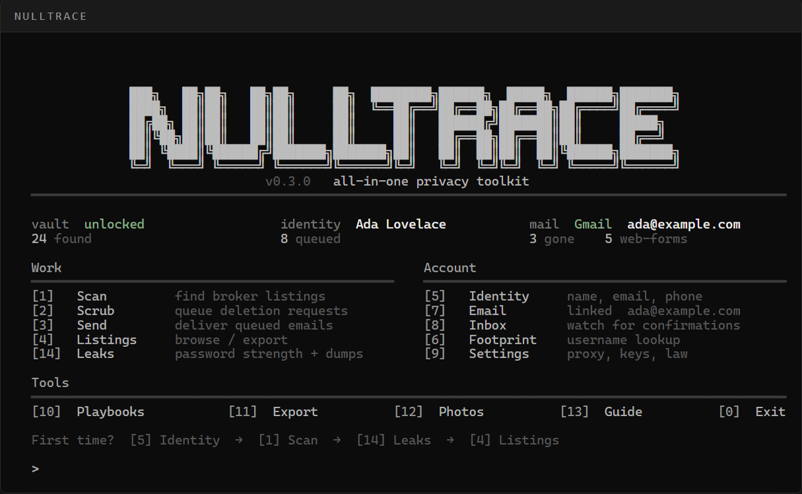
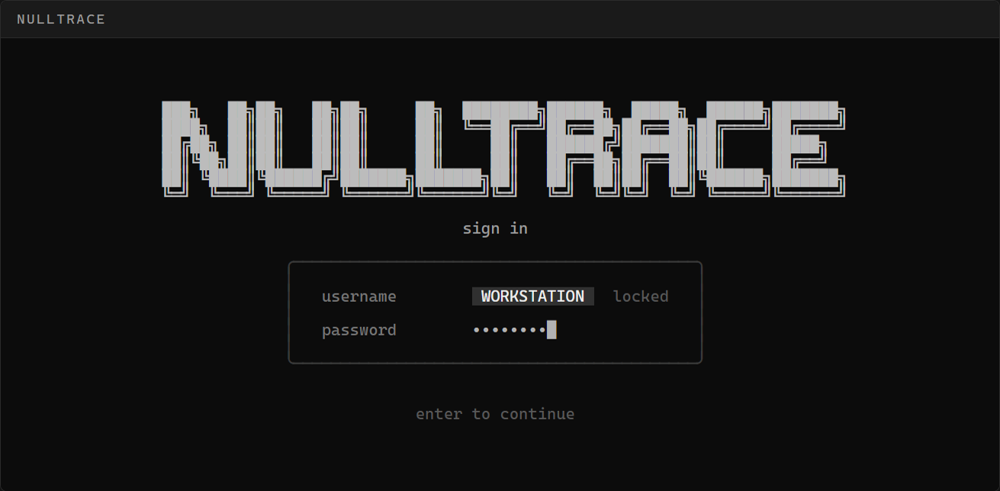

# NullTrace

A local-first privacy toolkit. It maps the name, email, and phone you type against a catalog of 400+ people-search and marketing brokers, queues CCPA/GDPR deletion mail, and checks whether a password already sits in public dumps. The vault is a file on your PC. There is no NullTrace account.

<p align="center">
  
</p>

[](source/go.mod)
[](https://github.com/4x3/nulltrace/actions)
[](https://github.com/4x3/nulltrace/releases)
[](LICENSE)

## What it is, and what it is not

Scan is not a live crawl of the internet. It scores your identity against a maintained broker catalog (Spokeo, Whitepages, people-search farms, ad-tech aggregators, that whole neighborhood) and tells you which ones are worth a deletion request.

Leaks does not ask Have I Been Pwned which *accounts* were in a breach. That API needs a key. What it does do: local strength scoring, a common-password list, and the public Pwned Passwords range API. Only the first five hex characters of `SHA-1(password)` leave the machine.

Browser automation and CapSolver exist in the tree and stay **off** unless you turn them on. The default path is: catalog match → templated email → you send it from a mailbox you already own.

<p align="center">
  
</p>

The username is the computer name and it is locked on purpose. The password is the vault key.

## Windows

A Windows zip is on the [Releases](https://github.com/4x3/nulltrace/releases) page if you would rather not build from source.

Double-click `NullTrace.exe` after you build. Keep it next to the `app` folder.

```powershell
git clone https://github.com/4x3/nulltrace.git
cd nulltrace
powershell -File source\build.ps1
.\NullTrace.exe
```

First open: loading bar, then create a login. Later opens ask for that same password. Wrong password stays on the login screen.

The first-run identity form (and **[5] Identity** later) checks names, email, phone, date of birth, and city. Leave a field blank to skip it.

From the home menu:

1. **[5] Identity** — the name / email / phone the people-search sites actually have on you
2. **[1] Scan** — match that identity against the catalog
3. **[14] Leaks** — optional, check a password
4. **[4] Listings** — browse, search, export
5. **[7] Email** — Gmail, Outlook, or Yahoo via an App Password (your normal mailbox password will not work)
6. **[2] Scrub** then **[3] Send** — queue and deliver deletion mail
7. **[10] Playbooks** — brokers that only offer a web form

Nested screens use `[0] back` and `[m] main menu`.

## Other platforms

Go 1.23+, CGO off.

```sh
cd source
go test ./...
go build -trimpath -ldflags="-s -w" -o nulltrace ./cmd/nulltrace
```

There is a daemon (`nulltraced`) and a Compose file if you want the vault unlocked on a box and the CLI talking to `127.0.0.1:7738`. See `source/docker-compose.yml` and `source/scripts/systemd/nulltraced.service`.

```sh
nulltrace --version
```

## Where files live

| | Windows | Unix |
|---|---|---|
| Vault | `%LocalAppData%\nulltrace` | `$XDG_DATA_HOME/nulltrace` |
| Config | `%AppData%\nulltrace` | `$XDG_CONFIG_HOME/nulltrace` |

Config is YAML (`source/config.example.yaml` is the default shape). Mailbox passwords, HIBP keys, and CapSolver keys go in the encrypted vault, not the YAML.

## How mail is sent

NullTrace opens the provider's App Password page in your browser. You paste a 16-character App Password back in. SMTP is probed before it is stored. Optional IMAP watches the same account for confirmation mail. There is no OAuth app and no NullTrace inbox.

Templates live under `source/internal/engine/mailer/templates/` (CCPA, GDPR, state). The jurisdiction is a setting.

## Catalog

Broker rows are YAML in `source/internal/broker/data/`. They go stale. A pull request that adds or fixes an opt-out URL is more useful than a hot take. Do not commit a live vault export.

## Development

```sh
cd source
go test ./...
```

Windows console size is pinned to the window, not the 3000-row scrollback buffer — that used to smear the login field. If you touch `source/internal/tui/login.go` or `source/cmd/nulltrace/console_windows.go`, keep the login tests green.

Please read [SECURITY.md](SECURITY.md) before filing anything that looks like a vault bypass.

## License

[MIT](LICENSE)
